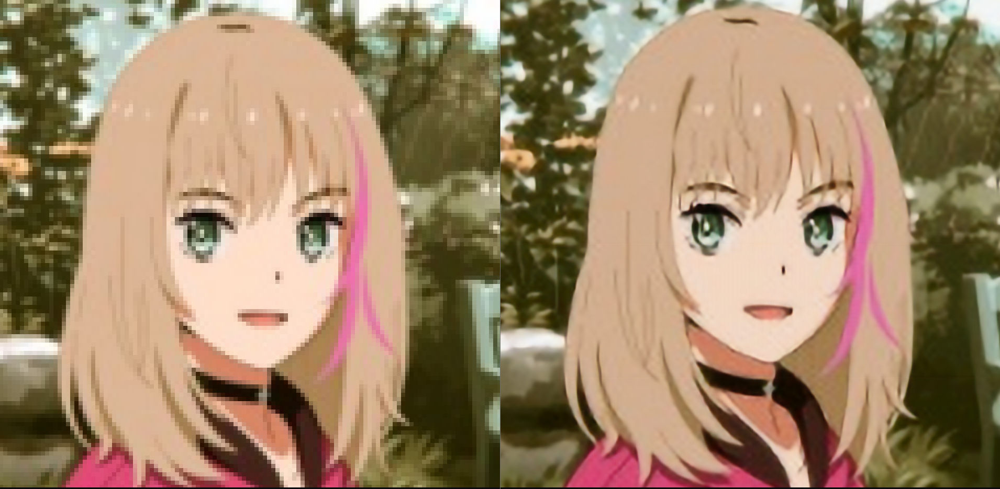
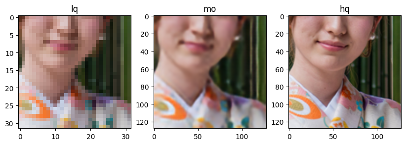
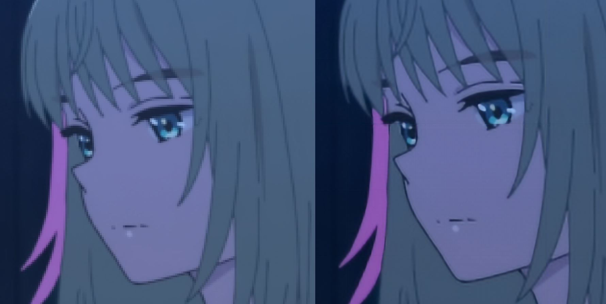
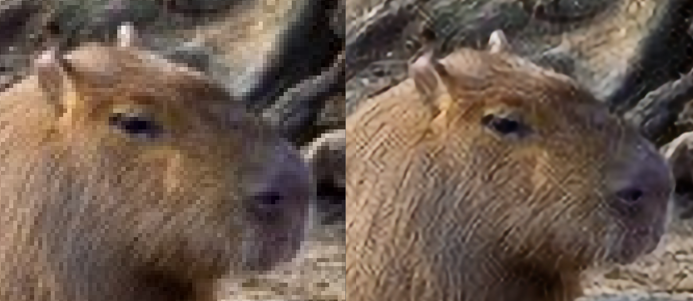

# pythorch-upscaler
## not the best but good enough as a small project

the dataset used is DIV2K_train_LR_bicubic 
- 800 images in X2 folder as target data and i downstacled them as input data

it upsclaes 4x in 128x128 chunks (that can be changed) so there are visible lines in the upscaled images (if the input image is more than 128px)

and also if the image had artifacts they will also be visible in the upscaled version

other than that it looks a more blurry than i would've wanted but i think if i add more unet layers and/or train it for longer that will improve
:-------------------------:

maybe it will be better if i train it with more data (duh)
also adding anime data wouldn't be bad

